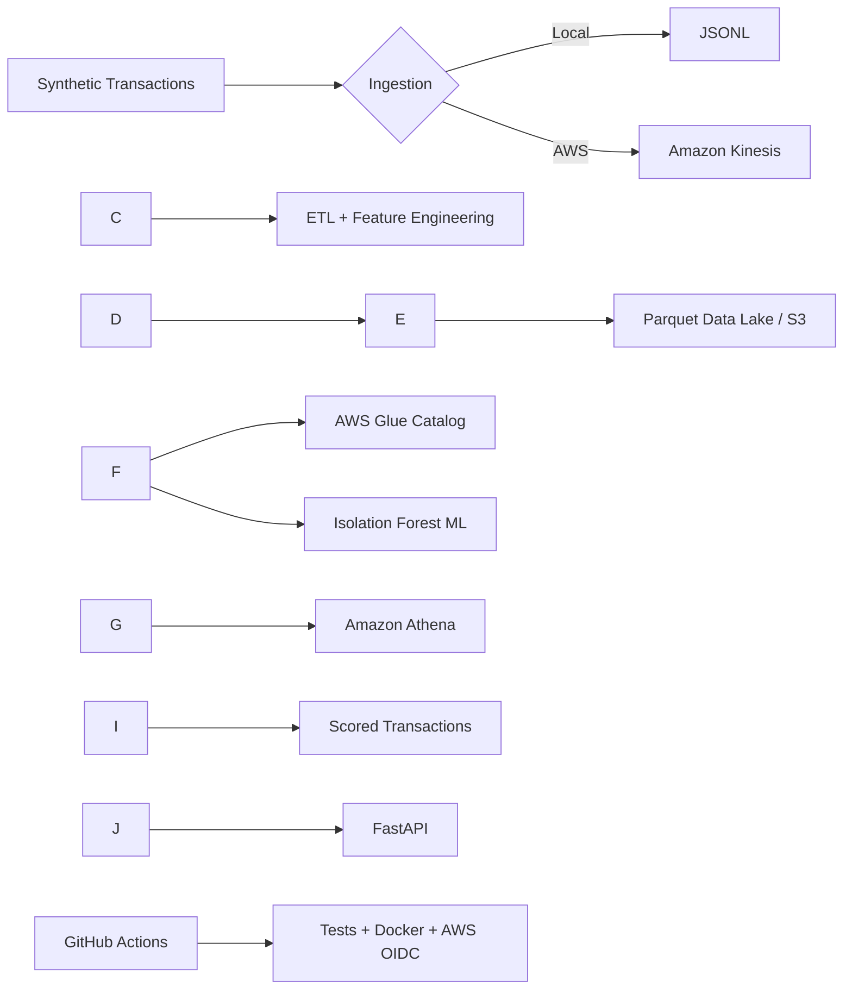

# CloudPulse AI — Real-Time AI-Powered Data Engineering Platform

A portfolio-grade end-to-end platform for **Data Engineering + AWS Cloud + Machine Learning + Backend Engineering**.

## Architecture



## Skills demonstrated

* **Data Engineering:** streaming ingestion, validation, ETL, feature engineering, Parquet and data-lake architecture.
* **Cloud:** Kinesis, S3, Glue, Athena, IAM-ready infrastructure.
* **AI/ML:** unsupervised anomaly detection with reproducible training and inference.
* **Software Development:** Python modules, FastAPI, typed schemas, testing and Docker.
* **DevOps/MLOps:** GitHub Actions CI and an AWS OIDC deployment pattern.

## Stack

Python · FastAPI · Pandas · PyArrow · scikit-learn · Boto3 · AWS Kinesis · S3 · Glue · Athena · Docker · GitHub Actions

## Quick start

```bash
git clone https://github.com/Subhashgolla/cloudpulse-ai.git
cd cloudpulse-ai
python -m venv .venv
# Windows: .\\.venv\\Scripts\\Activate.ps1
# macOS/Linux: source .venv/bin/activate
pip install -r requirements.txt
cp .env.example .env
python scripts/demo.py
uvicorn app.api.main:app --reload
```

Open `http://localhost:8000/docs`.

## Endpoints

* `GET /health`
* `GET /api/v1/analytics/summary`
* `GET /api/v1/transactions?limit=20`
* `GET /api/v1/anomalies?limit=20`

## AWS mode

Set `APP\_MODE=aws`, your region, Kinesis stream and unique S3 bucket in `.env`. Provision starter resources:

```bash
aws cloudformation deploy --template-file infra/cloudformation.yml --stack-name cloudpulse-ai --parameter-overrides DataLakeBucketName=YOUR\_UNIQUE\_BUCKET
```

Then generate streaming events:

```bash
python scripts/seed\_data.py --count 100
```

`put\_records` is batched at up to 500 events per request and reports partial failures.

## Data lake

The intended cloud layout is:

```text
s3://<bucket>/raw/transactions/
s3://<bucket>/curated/transactions/
s3://<bucket>/scored/transactions/
```

Curated data is Parquet and `infra/athena.sql` provides a starter Athena external table.

## ML

The model is an Isolation Forest using amount, event hour, international/card-present indicators, transaction velocity and customer-baseline deviation. It is intentionally unsupervised because this synthetic dataset has no verified fraud labels.

**No fabricated model-accuracy or scale claims are included.** Add measured metrics only after running a labeled experiment.

## CI/CD

The CI workflow runs tests, compile checks and a Docker build. `deploy-aws.yml` demonstrates GitHub-to-AWS authentication with OIDC; configure a least-privilege AWS role and store only its ARN as `AWS\_ROLE\_ARN`.

## Resume-ready bullets

Use these after running and understanding the project:

* Architected an end-to-end real-time data platform using Python, Amazon Kinesis, S3, Glue and Athena to ingest, transform, catalog and analyze transaction events.
* Developed an ML anomaly-detection pipeline with behavioral feature engineering and exposed scored transaction insights through containerized FastAPI endpoints.
* Implemented automated testing, Docker packaging and GitHub Actions CI/CD with an AWS OIDC deployment pattern.

## Interview talking points

Be ready to explain: why streaming, Kinesis partition keys, Parquet vs CSV, Glue/Athena metadata, anomaly detection vs supervised fraud classification, API design, Docker, least-privilege IAM, and how you would productionize monitoring/model retraining.

## Suggested GitHub description

> Real-time AI-powered data engineering platform using Python, AWS Kinesis/S3/Glue/Athena, FastAPI, Docker and ML anomaly detection.

## Next production upgrades

Glue Spark ETL · Kinesis Firehose/Lambda consumer · Redshift · SageMaker · CloudWatch · React dashboard · Terraform/CDK · data-quality checks.

## Author

**Subhash Krishna Golla**  
GitHub: https://github.com/Subhashgolla 
LinkedIn: https://www.linkedin.com/in/subhashkrishna

## License

MIT

